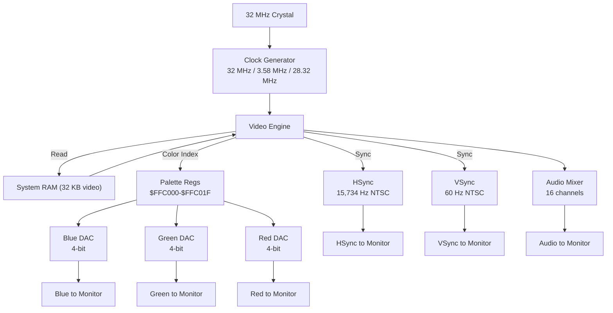

# Shifter / GTia Video Controller

> The Shifter (VDC, Video Display Controller) chip generates RGB video signals and audio output for the Atari ST. It reads the framebuffer directly from system RAM.

## Shifter Chip

### Overview

| Parameter | ST | STe |
|--|--|-|
| Part number | C028787-2 (NTSC) / C028761-1 (PAL) | C029145 (GST Shifter) |
| Package | PLCC68 / QFP | PLCC68 (SMT on STe) |
| Pixel clock | 32.000 MHz | 32 MHz (NTSC) / 28.3226 MHz (PAL) |
| Color depth | 4 bits per color index (16 colors) | 6 bits per color index (512 colors) |
| Audio channels | 3 channels (PGS mixed) | 16 audio channels + 8-bit stereo DAC |

### Pinout (40-pin)

| Pin | Signal | Direction | Description |
|-----|- ------|-|--|
| 1 | XTL0 | Input | 32 MHz crystal |
| 2 | 32MHz_XTL1 | Input | 32 MHz crystal |
| 3-10 | D0-D7 | I/O | Data bus (lower 8 bits) |
| 11 | !LOAD | Input | Active load |
| 12-19 | D8-D15 | I/O | Data bus (upper 8 bits) |
| 20 | GND | Ground | |
| 21 | B2 | Output | Blue DAC bit 2 |
| 22 | B1 | Output | Blue DAC bit 1 |
| 23 | B0 | Output | Blue DAC bit 0 |
| 24 | G2 | Output | Green DAC bit 2 |
| 25 | G1 | Output | Green DAC bit 1 |
| 26 | G0 | Output | Green DAC bit 0 |
| 27 | R2 | Output | Red DAC bit 2 |
| 28 | R1 | Output | Red DAC bit 1 |
| 29 | R0 | Output | Red DAC bit 0 |
| 30 | MONO | Input | Monochrome detect / color control |
| 31-40 | Various | I/O | Control pins, address bus, clock |

### Shifter Internal Architecture



## Video Modes (ST/STe)

### LORAM (Low Resolution) - 320×200 × 16 colors

| Parameter | Value |
|-- | -- |
| Resolution | 320 × 200 pixels |
| Color depth | 4 bits per pixel (2 pixels per byte) |
| Memory | 32 KB ($A0000-$A7FFF) |
| Palette | 16 of 512 colors |
| Bits per line | 160 bytes (80 pixels × 2 pixels/byte) |
| Total lines | 200 visible |
| Bytes per line | 160 |

Each byte stores 2 pixels: high nibble = left pixel, low nibble = right pixel.
Example: byte $F0 = [white] [black]

### MORAM (Medium Resolution) - 640×200 × 4 colors

| Parameter | Value |
|-- | -- |
| Resolution | 640 × 200 pixels |
| Color depth | 2 bits per pixel (4 pixels per byte) |
| Memory | 16 KB ($A0000-$A3FFF) |
| Palette | 4 of 512 colors |
| Pixels per byte | 4 pixels per byte |

Each byte stores 4 pixels: 2 bits per pixel (bits 6-7, 4-5, 2-3, 0-1).

### HIRE (High Resolution) - 640×400 × 1 (mono)

| Parameter | Value |
|-- | -- |
| Resolution | 640 × 400 pixels (mono) |
| Color depth | 1 bit per pixel (8 pixels per byte) |
| Memory | 16 KB ($A0000-$A3FFF) |
| Mode | Monochrome (or 2-color) |
| Pixels per byte | 8 pixels per byte (1 bit each, MSB first) |

Each byte: bit 7 = leftmost pixel, bit 0 = rightmost pixel of 8.

## STe Color Modes

The Super Shifter (GST Shifter C029145) adds:

| Mode | Resolution | Colors | Palette |
|------|--|--------|---------|
| STe Low | 320×200 | 16 of 512 | 6-bit palette |
| STe Med | 640×200 | 16 of 512 | 6-bit palette |
| STe Hi-Color | 640×200 | 64 of 512 | 6-bit palette |
| STe Hi-Res | 640×400 | 2 of 512 | 6-bit palette |
| STe Super Hi-Res | 640×480 | 16 of 512 | 6-bit palette |

### STe Register Differences

The STe Shifter has 32 color registers at $FFC000-$FFC01F:
- $FFC040 through $FFC07F in some implementations

Each color is 6 bits per component (R=6, G=6, B=6 = 512 colors total).
The color registers work as follows:
- $FFC000-$FFC01F: 32 palette entries (6 bits each for R, G, B)
- Each color = 18 bits total (6 bits per component)

## Video Memory Layout

### LORAM (320×200×16)

```
         $A0000 +------------------+
                  |    Pixel row 0   |  160 bytes
                  +------------------+
                  |    Pixel row 1   |  160 bytes
                  +------------------+
                  |       ...         |
                  +------------------+
                  |    Pixel row 199  |  160 bytes
                  +------------------+
         $A7FFF  +------------------+
```

Each byte: nibble pairs [high | low], where each nibble is a color palette index (0-15).

Pixels per line layout for $A0000 = [0|1][2|3][4|5]...[158|159] for left-to-right.

### MORAM (640×200×4)

```
         $A0000 +------------------+
                  |    Pixel row 0   |   80 bytes
                  +------------------+
                  |    Pixel row 1   |   80 bytes
                  +------------------+
                  |       ...         |
                  +------------------+
                  |    Pixel row 199  |   80 bytes
                  +------------------+
         $A3FFF  +------------------+
```

Each byte: [p0(2 bits)|p1(2 bits)|p2(2bits)|p3(2bits)].

### HIRE (640×400×1)

```
         $A0000 +------------------+
                  |    Pixel row 0   |   80 bytes (8 pixels/byte)
                  +------------------+
                  |    Pixel row 1   |   80 bytes
                  +------------------+
                  |       ...         |
                  +------------------+
                  |    Pixel row 399  |   80 bytes
                  +------------------+
         $A3FFF  +------------------+
```

Each byte: [p0|p1|p2|p3|p4|p5|p6|p7] where each p is 1 bit (MSB first).

## Shifter Register Map

### Control Registers

All at $FFCxxx range (Shifter address space):

| Address | Size | Name | Read/Write | Description |
|-- ------|---|- ----|-|- |
| $FFC000 | 32 bytes | Palette | R/W | Color palette (16 entries × 1 byte) |
| $FFC040 | 16 bytes | Audio 0-15 vol | R/W | Audio volume control channels |
| $FFC100 | 128 bytes | Reserved | - | |
| $FFC200 | 16 bytes | Control | R/W | Video control registers |
| $FFC400 | 1 byte | VDP status | R | Video display status |
| $FFC401 | 1 byte | Display control | W | Display enable |
| $FFC402 | 1 byte | Interrupt enable | W | Video interrupt control |
| $FFC420-43F | 32 bytes | VDP registers | R/W | Various VDP settings |

### Video Control Register at $FFC200

| Bit | Name | Description |
|-----|- ----|--|
| 0 | DISPLAY | Display enable (1 = on) |
| 1 | HORIZONTAL | 2 = LORAM, 1 = MORAM, 0 = HIRE |
| 2 | PALETTE | Palette select (bit plane) |
| 3 | 16/4 colors | 1 = 16 colors, 0 = 4 colors |
| 4 | MONO | 1 = monochrome |
| 5 | VERTICAL | Vertical timing selector |
| 6 | - | Unused |
| 7 | | Unused |

### VDP Status Register (Read $FFC400)

| Bit | Name | Description |
|-----|- -----|-|
| 0 | VBL | Vertical blank |
| 1 | HBL | Horizontal blank |
| 2-3 | - | Unused |
| 4 | COLOR | 1 = color monitor, 0 = monochrome |
| 5 | HPOS | Horizontal cursor position |
| 6 | HPOS | Horizontal position high |
| 7 | - | Unused |

```

## Color Model: RGB to DAC

The ST uses **R1R0 G1G0 B1B0** 4-bit color indexing (16 colors). The DAC generates analog voltage from these 4 bits per component.

Color register at $FFC000-$FFC01F:
- Each byte = one 18-bit color value
- Byte n: [r2 r1 r0 g2 g1 g0 b2 b1 b0] (3 × 6 bits, 3 bytes = one color)
Actually the $FFCxxx registers store 3-byte color entries:
- Register $FFCx0 + n: blue component (6 bits)
- Register $FFCx1 + n: green component (6 bits)
- Register $FFCx2 + n: red component (6 bits)

Wait - the actual ST memory-mapped palette works differently:

The ST palette is stored at $FFC000-$FFC01F as bytes. On the original ST (4-bit palette), each byte's lower 6 bits encode the colors, and the ST firmware maps them to standard VGA-like colors.

On the STe the palette is at $FFC000-$FFC063:
- Each entry = 3 consecutive bytes (B, G, R)
- Each component = 6 bits

### Palette Example (STe)

Color entry n at offset n × 3 from $FFC000:
```
$FFC000 + 3n:   blue (bits 0-5)
$FFC000 + 3n+1: green (bits 0-5)
$FFC000 + 3n+2: red (bits 0-5)
```

### Timing

**NTSC timing:**
- Horizontal: 312 pixels/line, 525 lines/frame, 15,734.056 Hz
- Vertical: 60 Hz (60.008 Hz exact)
- Pixel clock: 32.000 MHz
- Line period: ~63.556 us
- Frame period: ~16.664 ms

**PAL timing:**
- Horizontal: 312 pixels/line, 625 lines/frame, 15,625 Hz
- Vertical: 50 Hz exact
- Pixel clock: 35.46895 MHz (NTSC color subcarrier × 126) or 28.3226 MHz (PAL)
Actually for PAL ST:
- Pixel clock: 28.3226 MHz
- Line period: ~64 us
- Frame period: 20 ms (50 Hz)

## Video Memory Addressing for Scrolling

The ST MMU provides hardware scrolling in hires/LORAM modes:

### Scroll Mechanism

1. The MMU has scroll registers (at $FFE000-$FFE01F) that add to the base address
2. For LORAM: scroll registers 0-2 control horizontal scroll (each = 12 bits, total 36-bit scroll)
3. For HIRE: scroll registers control vertical scroll (each = 12 bits)
4. The Shifter reads from (base_address + scroll_value) in video memory

### Register mapping for scroll:

| Register | Address | Size | Function |
|-- | ---- |- --|-- |
| Scroll 0 | $FFE000 | 12 bits | Lower 12 bits of scroll address |
| Scroll 1 | $FFE002 | 12 bits | Bits 12-23 of scroll address |
| Scroll 2-5 | $FFE004-$FFE00B | 12 bits | Higher scroll digits |
| Scroll 6-7 | $FFE00E-$FFE016 | 12 bits | Reserved/DMA |

## References

- [Atari ST Internals, Ch. 1.3 - Shifter (PDF)](https://www.atarimania.com/documents/Atari-ST-Internals.pdf)
- [Atari ST Review #9 - Shifter specifications](https://www.atarimania.com/mags/pdf/atari_st_review-issue_09.pdf)
- [Info-Coach Video info (DrCoolZic)](https://info-coach.fr/atari/hardware/video.php)
- [Atari ST Bus Doc - Shifter](http://info-coach.fr/atari/ressources/doc/Atari%20ST%20bus%20doc.pdf)
