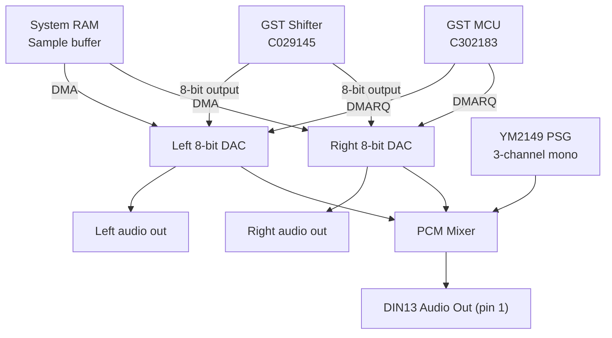

# Stereo Sound / 8-bit PCM DMA

> The STe adds an 8-bit stereo DAC with DMA support, separate from the YM2149 PSG.

## Overview

The STe's GST Shifter (C029145) includes an 8-bit stereo DAC with DMA:

| Parameter | Value |
|--|-- |
| Resolution | 8 bits |
| Channels | 2 (stereo) |
| Sample rate | Up to ~38 kHz (mono) / ~19 kHz (stereo) |
| DMA enabled | Yes (via GST MCU) |
| Memory mapping | System RAM |
| Register control | GST Shifter at $FFCxxx |
| PCM sample memory | System RAM (any address) |

## Audio Architecture



## Controls

### Sample Data Register

| Address | Read/Write | Description |
|--|--|-- |
| $FFC61C | R/W | Sample data register (8 bits) |
| $FFC61E | R/W | Sample address increment register (8 bits) |
| $FFC622 | R/W | Sample DMA control register |
| $FFC626 | R/W | Sample volume register (8 bits) |
| $FFC62A | R/W | Sample loop start address (16 bits) |
| $FFC62C | R/W | Sample loop start address high (16 bits) |
| $FFC62E | R/W | Sample loop end address (16 bits) |
| $FFC630 | R/W | Sample loop end address high (16 bits) |

### Sample DMA Control Register ($FFC622)

| Bit | Name | Description |
|-----|-|-----|
| 0 | Enable | 1 = start sample playback, 0 = stop |
| 1 | Loop | 1 = loop the sample, 0 = play once |
| 2 | Right channel | 1 = right channel, 0 = left channel |
| 3 | 8-bit mode | 1 = 8-bit, 0 = 4-bit |
| 4 | Reserved | |
| 5 | Mode | 0 = normal, 1 = stereo |
| 6-7 | Frequency select | Sample rate control |

### Stereo Mode (bit 5 = 1)

In stereo mode:
- Left and right channels are interleaved
- Each sample is 16 bits (8 bits left, 8 bits right)
- Sample rate halved (mono: 38.5 kHz → stereo: 19.3 kHz)

### Frequency Select (bits 6-7)

| Value | Sample Rate (mono) | Sample Rate (stereo) |
|--|--|--|
| 00 | ~9.6 kHz | ~4.8 kHz |
| 01 | ~19.3 kHz | ~9.6 kHz |
| 10 | ~38.5 kHz | ~19.3 kHz |
| 11 | ~77.0 kHz | ~38.5 kHz |

## Playback Flow

1. Write sample frequency/select to register $FFC622
2. Write loop start address to $FFC62A/$FFC62C
3. Write loop end address to $FFC62E/$FFC630
4. Write sample data to $FFC61C
5. Set Enable bit (bit 0) of $FFC622 to start playback
6. GST MCU generates DMA cycle to read from sample memory
7. GST Shifter converts to analog output on DAC pins

## Sample Memory

The sample data is stored in system RAM. The DMA engine automatically reads consecutive bytes:

```
Sample buffer at any RAM address:
Byte 0: sample value 0 (left)
Byte 1: sample value 1 (right, if stereo)
Byte 2: sample value 2 (left)
Byte 3: sample value 3 (right, if stereo)
...
Byte n: end of loop (loops back to start)
```

## Volume Control

The sample volume is controlled by a separate register:
| Address | Range | Description |
|-- | --- |-|
| $FFC626 | 0-255 | Volume level (0 = silent, 255 = max) |

The YM2149 PSG and the PCM DAC are mixed through the GST Shifter's audio mixer before being output to the audio jack.

## References

- [Info-Coach - STE Hardware](https://info-coach.fr/atari/hardware/STE-HW.php)
- [Atari ST Internals - PCM sound section (PDF)](https://www.atarimania.com/documents/Atari-ST-Internals.pdf)
- [AtariForumWiki - PCM sample](https://temlib.org/AtariForumWiki/index.php/Introduction_to_the_STE)
