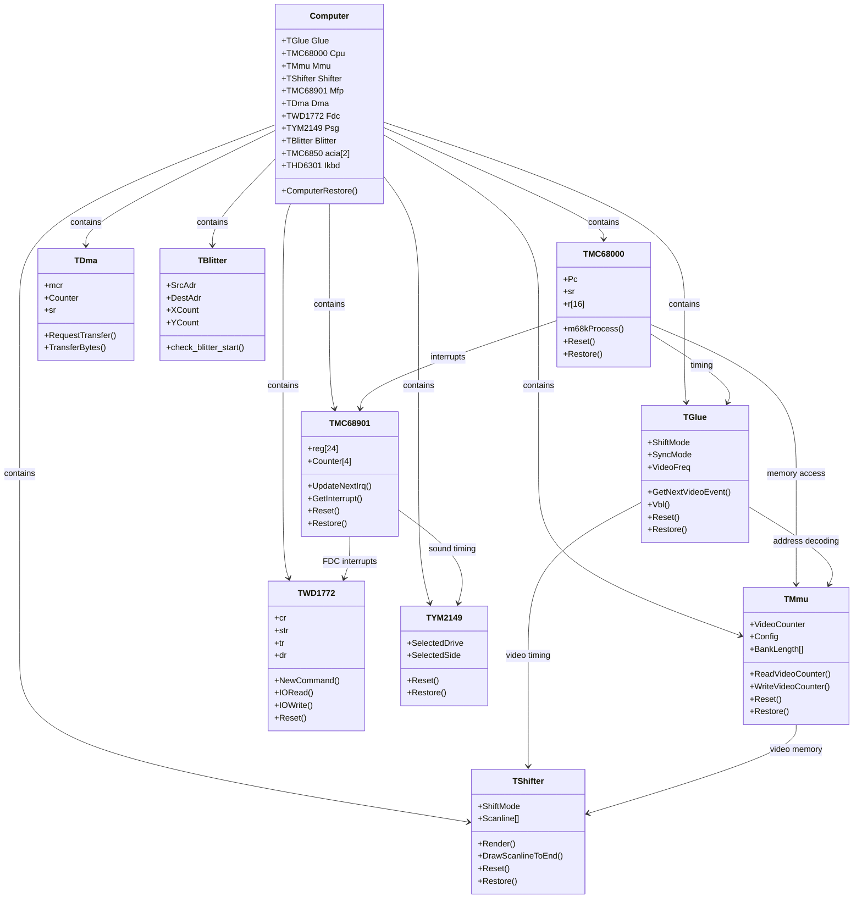
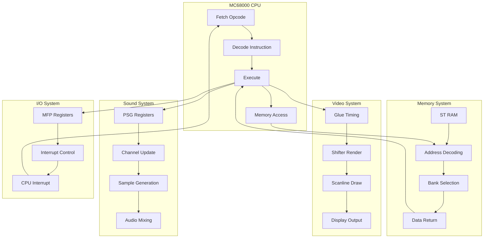
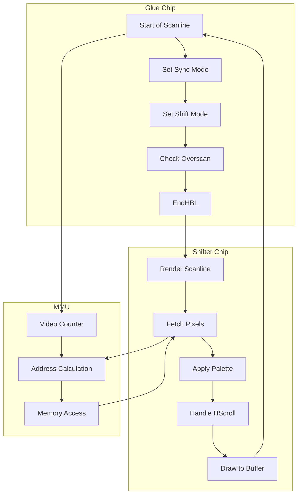
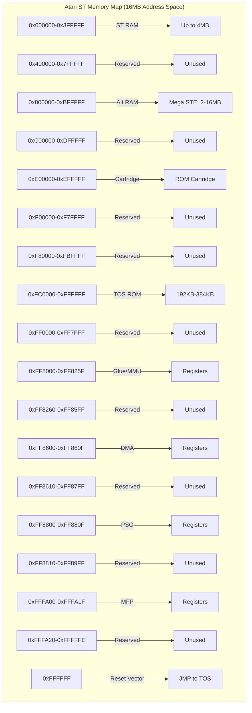

# System Architecture Diagrams

## Overview

This document contains diagrams illustrating the Steem SSE emulator's system architecture and component relationships.

## 1. Overall System Architecture

### Mermaid Diagram: Component Hierarchy



### ASCII Diagram: System Block Structure

```
┌─────────────────────────────────────────────────────────────────────────┐
│                         STEEM SSE EMULATOR                                    │
├─────────────────────────────────────────────────────────────────────────┤
│                                                                             │
│  ┌─────────────────────────────────────────────────────────────────┐   │
│  │                        MAIN SYSTEM                                    │   │
│  │  ┌─────────────┐  ┌─────────────┐  ┌─────────────┐  ┌────────────┐ │   │
│  │  │  Steem.cpp  │  │ run.cpp     │  │ computer.cpp│  │emulator.cpp│ │   │
│  │  │  Main entry │  │ Execution   │  │ Components  │  │ Timing     │ │   │
│  │  └─────────────┘  └─────────────┘  └─────────────┘  └────────────┘ │   │
│  └─────────────────────────────────────────────────────────────────┘   │
│                                    │                                         │
│                                    ▼                                         │
│  ┌─────────────────────────────────────────────────────────────────┐   │
│  │                      HARDWARE COMPONENTS                              │   │
│  │                                                                     │   │
│  │  ┌─────────────┐  ┌─────────────┐  ┌─────────────┐  ┌─────────────┐ │   │
│  │  │   CPU       │  │   GLUE      │  │   MMU       │  │  SHIFTER    │ │   │
│  │  │ TMC68000    │  │  TGlue       │  │  TMmu       │  │ TShifter    │ │   │
│  │  │  cpu.cpp    │  │ glue.cpp     │  │ mmu.cpp     │  │shifter.cpp  │ │   │
│  │  └─────────────┘  └─────────────┘  └─────────────┘  └─────────────┘ │   │
│  │                                                                     │   │
│  │  ┌─────────────┐  ┌─────────────┐  ┌─────────────┐  ┌─────────────┐ │   │
│  │  │   MFP       │  │   PSG       │  │   FDC       │  │   DMA       │ │   │
│  │  │TMC68901     │  │ TYM2149     │  │ TWD1772     │  │ TDma        │ │   │
│  │  │ mfp.cpp     │  │ psg.cpp     │  │ fdc.cpp     │  │ dma.cpp     │ │   │
│  │  └─────────────┘  └─────────────┘  └─────────────┘  └─────────────┘ │   │
│  │                                                                     │   │
│  │  ┌─────────────┐  ┌─────────────┐  ┌─────────────┐  ┌─────────────┐ │   │
│  │  │  ACIA       │  │  IKBD       │  │  BLITTER    │  │   RTC       │ │   │
│  │  │ TMC6850     │  │ THD6301     │  │ TBlitter    │  │MC146818A    │ │   │
│  │  │ acia.cpp    │  │ ikbd.cpp     │  │blitter.cpp  │  │ rtc.cpp     │ │   │
│  │  └─────────────┘  └─────────────┘  └─────────────┘  └─────────────┘ │   │
│  └─────────────────────────────────────────────────────────────────┘   │
│                                    │                                         │
│                                    ▼                                         │
│  ┌─────────────────────────────────────────────────────────────────┐   │
│  │                      SUPPORT SYSTEMS                                │   │
│  │                                                                     │   │
│  │  ┌─────────────┐  ┌─────────────┐  ┌─────────────┐  ┌─────────────┐ │   │
│  │  │  Video      │  │  Sound      │  │  Memory     │  │  Input      │ │   │
│  │  │ display.cpp │  │ sound.cpp   │  │ mmu.cpp     │  │ stjoy.cpp   │ │   │
│  │  └─────────────┘  └─────────────┘  └─────────────┘  └─────────────┘ │   │
│  │                                                                     │   │
│  │  ┌─────────────┐  ┌─────────────┐  ┌─────────────┐  ┌─────────────┐ │   │
│  │  │  Disk       │  │  Hard Disk  │  │  Debug      │  │   GUI       │ │   │
│  │  │ floppy.cpp  │  │ acsi.cpp    │  │ debug*.cpp  │  │ gui.cpp     │ │   │
│  │  └─────────────┘  └─────────────┘  └─────────────┘  └─────────────┘ │   │
│  └─────────────────────────────────────────────────────────────────┘   │
│                                                                             │
└─────────────────────────────────────────────────────────────────────────┘
```

## 2. Component Communication

### Mermaid Diagram: Data Flow



### ASCII Diagram: Interrupt Flow

```
┌─────────────────────────────────────────────────────────────────────────┐
│                         INTERRUPT FLOW DIAGRAM                                 │
├─────────────────────────────────────────────────────────────────────────┤
│                                                                             │
│  HARDWARE EVENTS                                                          │
│  ┌─────────────┐  ┌─────────────┐  ┌─────────────┐  ┌─────────────┐    │
│  │  VBL Timer  │  │  HBL Timer  │  │ FDC IRQ     │  │ MFP Timer   │    │
│  │  (Glue)     │  │  (Glue)     │  │ (WD1772)    │  │ (MC68901)   │    │
│  └──────┬──────┘  └──────┬──────┘  └──────┬──────┘  └──────┬──────┘    │
│         │                │                │                │            │
│         └────────────────┼────────────────┼────────────────┘            │
│                          │                │                              │
│                          ▼                ▼                              │
│                 ┌─────────────────────────────────┐                   │
│                 │         MFP INTERRUPT CONTROLLER  │                   │
│                 │      (TMC68901::UpdateNextIrq)    │                   │
│                 └────────────────┬────────────────┘                   │
│                                  │                                      │
│                                  ▼                                      │
│                         ┌─────────────────┐                            │
│                         │  SetPending()   │                            │
│                         │  (IRQ Flag)     │                            │
│                         └────────┬────────┘                            │
│                                  │                                      │
│                                  ▼                                      │
│                         ┌─────────────────┐                            │
│                         │  CPU IPL Check  │                            │
│                         │  (Priority)      │                            │
│                         └────────┬────────┘                            │
│                                  │                                      │
│         ┌────────────────────────┼────────────────────────┐          │
│         ▼                            ▼                            ▼          │
│  ┌─────────────┐          ┌─────────────┐          ┌─────────────┐    │
│  │  Level 7    │          │  Level 4-6  │          │ Level 1-3   │    │
│  │  (Reset)    │          │  (MFP IRQs) │          │ (Peripheral)│    │
│  └─────────────┘          └─────────────┘          └─────────────┘    │
│         │                            │                            │          │
│         └────────────────────────┼────────────────────────┘          │
│                                  │                                      │
│                                  ▼                                      │
│                         ┌─────────────────┐                            │
│                         │  m68k_interrupt()│                            │
│                         │  (CPU)          │                            │
│                         └────────┬────────┘                            │
│                                  │                                      │
│                                  ▼                                      │
│                         ┌─────────────────┐                            │
│                         │  Exception      │                            │
│                         │  Handler        │                            │
│                         └─────────────────┘                            │
│                                                                             │
└─────────────────────────────────────────────────────────────────────────┘
```

## 3. Video Rendering Pipeline

### Mermaid Diagram: Scanline Processing



### ASCII Diagram: Video Timing

```
┌─────────────────────────────────────────────────────────────────────────┐
│                      VIDEO TIMING DIAGRAM (50Hz PAL)                           │
├─────────────────────────────────────────────────────────────────────────┤
│                                                                             │
│  FRAME STRUCTURE:                                                          │
│  ┌─────────────────────────────────────────────────────────────────┐   │
│  │  VERTICAL BLANK (VBL)  │  VISIBLE AREA  │  VERTICAL BLANK (VBL) │   │
│  │  Lines 0-31            │  Lines 32-311 │  Lines 312-312        │   │
│  │  (32 lines)           │  (280 lines)  │  (1 line)            │   │
│  └─────────────────────────────────────────────────────────────────┘   │
│                                    │                                         │
│  SCANLINE STRUCTURE (512 cycles @ 8MHz = 64μs):                           │
│  ┌─────────────────────────────────────────────────────────────────┐   │
│  │ HBL | HSYNC | DE  | VISIBLE | DE  | HSYNC | HBL | BORDER │   │
│  │ 64  | 8     | 40  | 448     | 40  | 8     | 64  | (var)  │   │
│  │ cyc | cyc  | cyc | cyc    | cyc | cyc  | cyc |        │   │
│  └─────────────────────────────────────────────────────────────────┘   │
│                                    │                                         │
│  TIMING EVENTS:                                                           │
│  ┌─────────────────────────────────────────────────────────────────┐   │
│  │ Cycle 0:    Start of scanline (HBL starts)                         │   │
│  │ Cycle 64:   HBL ends, HSYNC starts                                     │   │
│  │ Cycle 72:   HSYNC ends, DE starts (left border)                      │   │
│  │ Cycle 112:  DE starts (visible area)                                  │   │
│  │ Cycle 552:  DE ends (right border)                                   │   │
│  │ Cycle 560:  HSYNC starts                                              │   │
│  │ Cycle 568:  HSYNC ends, HBL starts                                   │   │
│  │ Cycle 512:  End of scanline                                          │   │
│  └─────────────────────────────────────────────────────────────────┘   │
│                                    │                                         │
│  VBL INTERRUPT:                                                           │
│  ┌─────────────────────────────────────────────────────────────────┐   │
│  │ At line 312 (end of frame):                                         │   │
│  │   1. Glue.Vbl() is called                                           │   │
│  │   2. VBL interrupt is triggered in MFP                              │   │
│  │   3. MFP signals CPU via IRQ line                                    │   │
│  │   4. CPU processes interrupt at next instruction boundary         │   │
│  │   5. TOS VBL handler executes (if enabled)                         │   │
│  └─────────────────────────────────────────────────────────────────┘   │
│                                                                             │
└─────────────────────────────────────────────────────────────────────────┘
```

## 4. Memory Map

### Mermaid Diagram: Address Space



### ASCII Diagram: Memory Layout

```
┌─────────────────────────────────────────────────────────────────────────┐
│                     ATARI ST MEMORY MAP (24-bit address bus)                  │
├─────────────────────────────────────────────────────────────────────────┤
│                                                                             │
│  0x000000 ┌─────────────────────────────────────────────────────────┐ │
│           │                    ST RAM                                    │ │
│           │  ┌─────────────┐ ┌─────────────┐ ┌─────────────┐        │ │
│           │  │ 520ST:      │ │ 1040ST:     │ │ STE:        │        │ │
│           │  │ 512KB       │ │ 1MB         │ │ 1MB-4MB    │        │ │
│           │  │ (0x000000-  │ │ (0x000000-  │ │ (0x000000-  │        │ │
│           │  │  0x07FFFF)  │ │  0x0FFFFF)  │ │  0x3FFFFF)  │        │ │
│           │  └─────────────┘ └─────────────┘ └─────────────┘        │ │
│           │                                                         │ │
│           │  • Even bank: 0x000000, 0x020000, 0x040000, ...          │ │
│           │  • Odd bank:  0x010000, 0x030000, 0x050000, ...          │ │
│           │  • Bank size: 128KB (interleaved)                         │ │
│           └─────────────────────────────────────────────────────────┘ │
│                                                                             │
│  0x080000 ┌─────────────────────────────────────────────────────────┐ │
│           │                    RESERVED                                  │ │
│           │                    (Unused on ST/STE)                        │ │
│           └─────────────────────────────────────────────────────────┘ │
│                                                                             │
│  0xE00000 ┌─────────────────────────────────────────────────────────┐ │
│           │                    CARTRIDGE ROM                             │ │
│           │                    (128KB max)                               │ │
│           └─────────────────────────────────────────────────────────┘ │
│                                                                             │
│  0xFC0000 ┌─────────────────────────────────────────────────────────┐ │
│           │                    TOS ROM                                   │ │
│           │  ┌─────────────┐ ┌─────────────┐ ┌─────────────┐        │ │
│           │  │ 520ST:      │ │ 1040ST:     │ │ STE:        │        │ │
│           │  │ 192KB       │ │ 192KB       │ │ 256KB-384KB │        │ │
│           │  │ (TOS 1.00)  │ │ (TOS 1.04)  │ │ (TOS 1.06+) │        │ │
│           │  └─────────────┘ └─────────────┘ └─────────────┘        │ │
│           │                                                         │ │
│           │  • Mapped at 0xFC0000-0xFFFFFF                             │ │
│           │  • Also accessible at 0x00E00000-0x00EFFFFF (via MMU)      │ │
│           └─────────────────────────────────────────────────────────┘ │
│                                                                             │
│  0xFF0000 ┌─────────────────────────────────────────────────────────┐ │
│           │                    I/O REGISTERS                              │ │
│           │  ┌─────────────┐ ┌─────────────┐ ┌─────────────┐        │ │
│           │  │ 0xFF8000-    │ │ 0xFF8600-    │ │ 0xFF8800-    │        │ │
│           │  │ 0xFF825F:    │ │ 0xFF860F:    │ │ 0xFF880F:    │        │ │
│           │  │ Glue/MMU     │ │ DMA         │ │ PSG         │        │ │
│           │  └─────────────┘ └─────────────┘ └─────────────┘        │ │
│           │                                                         │ │
│           │  ┌─────────────┐ ┌─────────────┐ ┌─────────────┐        │ │
│           │  │ 0xFFFA00-    │ │ 0xFFFA20-    │ │ 0xFFFFFF:    │        │ │
│           │  │ 0xFFFA1F:    │ │ 0xFFFFFE:    │ │ Reset       │        │ │
│           │  │ MFP          │ │ Reserved    │ │ Vector      │        │ │
│           │  └─────────────┘ └─────────────┘ └─────────────┘        │ │
│           └─────────────────────────────────────────────────────────┘ │
│                                                                             │
└─────────────────────────────────────────────────────────────────────────┘
```

## 5. Component-Specific Diagrams

### CPU Architecture

```
┌─────────────────────────────────────────────────────────────────────────┐
│                         MC68000 CPU ARCHITECTURE                               │
├─────────────────────────────────────────────────────────────────────────┤
│                                                                             │
│  REGISTERS (32-bit):                                                          │
│  ┌─────────────────────────────────────────────────────────────────┐   │
│  │  D0-D7: Data Registers (32-bit each)                         │   │
│  │  A0-A7: Address Registers (32-bit each)                      │   │
│  │  PC: Program Counter (24-bit address bus)                    │   │
│  │  SR: Status Register (16-bit)                                │   │
│  │  USP: User Stack Pointer (A7)                                │   │
│  │  SSP: Supervisor Stack Pointer (A7 in supervisor mode)        │   │
│  └─────────────────────────────────────────────────────────────────┘   │
│                                                                             │
│  INSTRUCTION PIPELINE:                                                        │
│  ┌─────────────────────────────────────────────────────────────────┐   │
│  │                                                                  │   │
│  │  Fetch Stage:    Fetch opcode from memory at PC                │   │
│  │                  PC → Address Bus → Memory → IRC (16-bit)        │   │
│  │                                                                  │   │
│  │  Decode Stage:   Decode IRC to determine instruction           │   │
│  │                  IRC → Decoder → Instruction Handler            │   │
│  │                                                                  │   │
│  │  Execute Stage:   Execute instruction using registers          │   │
│  │                  Instruction → ALU/Registers → Result          │   │
│  │                                                                  │   │
│  │  Prefetch:       Fetch next opcode(s) during execution        │   │
│  │                  PC+2 → Address Bus → Memory → IR (16-bit)         │   │
│  │                  PC+4 → Address Bus → Memory → IRC (for next)     │   │
│  │                                                                  │   │
│  └─────────────────────────────────────────────────────────────────┘   │
│                                                                             │
│  EXCEPTION HANDLING:                                                         │
│  ┌─────────────────────────────────────────────────────────────────┐   │
│  │                                                                  │   │
│  │  1. Exception occurs (Bus Error, Address Error, etc.)          │   │
│  │  2. Current instruction completes or is aborted                │   │
│  │  3. Exception vector is fetched from memory                   │   │
│  │  4. SSP is decremented by 4, SR is saved at (SSP)             │   │
│  │  5. SSP is decremented by 4, PC is saved at (SSP)              │   │
│  │  6. Exception handler address is loaded into PC               │   │
│  │  7. Processing continues at exception handler                 │   │
│  │                                                                  │   │
│  └─────────────────────────────────────────────────────────────────┘   │
│                                                                             │
└─────────────────────────────────────────────────────────────────────────┘
```

### MFP (MC68901) Architecture

```
┌─────────────────────────────────────────────────────────────────────────┐
│                      MC68901 MFP ARCHITECTURE                                  │
├─────────────────────────────────────────────────────────────────────────┤
│                                                                             │
│  REGISTERS (24 x 8-bit):                                                      │
│  ┌─────────────────────────────────────────────────────────────────┐   │
│  │  General Purpose I/O:                                       │   │
│  │    GPIP (0xFA01) - General Purpose I/O Port                 │   │
│  │    DDR  (0xFA05) - Data Direction Register                   │   │
│  │    AER  (0xFA03) - Active Edge Register                      │   │
│  │                                                                  │   │
│  │  Interrupt Control:                                         │   │
│  │    IERA (0xFA07) - Interrupt Enable A                       │   │
│  │    IERB (0xFA09) - Interrupt Enable B                       │   │
│  │    IPRA (0xFA0B) - Interrupt Pending A                      │   │
│  │    IPRB (0xFA0D) - Interrupt Pending B                      │   │
│  │    ISRA (0xFA0F) - Interrupt In-Service A                    │   │
│  │    ISRB (0xFA11) - Interrupt In-Service B                    │   │
│  │    IMRA (0xFA13) - Interrupt Mask A                         │   │
│  │    IMRB (0xFA15) - Interrupt Mask B                         │   │
│  │    VR   (0xFA17) - Vector Register                          │   │
│  │                                                                  │   │
│  │  Timer Control:                                             │   │
│  │    TACR (0xFA19) - Timer A Control                           │   │
│  │    TBCR (0xFA1B) - Timer B Control                           │   │
│  │    TCDCR(0xFA1D) - Timers C & D Control                      │   │
│  │    TADR (0xFA1F) - Timer A Data                             │   │
│  │    TBDR (0xFA21) - Timer B Data                             │   │
│  │    TCDR (0xFA23) - Timer C Data                             │   │
│  │    TDDR (0xFA25) - Timer D Data                             │   │
│  │                                                                  │   │
│  │  USART (Serial):                                            │   │
│  │    SCR  (0xFA27) - Sync Character                           │   │
│  │    UCR  (0xFA29) - USART Control                            │   │
│  │    RSR  (0xFA2B) - Receiver Status                           │   │
│  │    TSR  (0xFA2D) - Transmitter Status                        │   │
│  │    UDR  (0xFA2F) - USART Data                               │   │
│  └─────────────────────────────────────────────────────────────────┘   │
│                                                                             │
│  INTERRUPT SOURCES (16 total, priority order):                                │
│  ┌─────────────────────────────────────────────────────────────────┐   │
│  │  15: Monochrome Monitor Detect                              │   │
│  │  14: RS232 Ring Indicator                                   │   │
│  │  13: Timer A                                                 │   │
│  │  12: RS232 Receive Buffer Full                              │   │
│  │  11: RS232 Receive Error                                     │   │
│  │  10: RS232 Transmit Buffer Empty                            │   │
│  │   9: RS232 Transmit Error                                   │   │
│  │   8: Timer B                                                 │   │
│  │   7: FDC and DMA                                             │   │
│  │   6: ACIA (IKBD & MIDI)                                      │   │
│  │   5: Timer C                                                 │   │
│  │   4: Timer D                                                 │   │
│  │   3: Blitter                                                 │   │
│  │   2: RS232 CTS                                               │   │
│  │   1: RS232 DCD                                               │   │
│  │   0: Centronics Busy                                         │   │
│  └─────────────────────────────────────────────────────────────────┘   │
│                                                                             │
│  GPIP BITS:                                                                   │
│  ┌─────────────────────────────────────────────────────────────────┐   │
│  │  Bit 0: Centronics Busy                                      │   │
│  │  Bit 1: RS232 DCD                                            │   │
│  │  Bit 2: RS232 CTS                                            │   │
│  │  Bit 3: Blitter Busy                                         │   │
│  │  Bit 4: ACIA (IKBD/MIDI)                                     │   │
│  │  Bit 5: FDC DRQ                                              │   │
│  │  Bit 6: RS232 Ring Indicator                                 │   │
│  │  Bit 7: Monochrome Monitor Detect                            │   │
│  └─────────────────────────────────────────────────────────────────┘   │
│                                                                             │
└─────────────────────────────────────────────────────────────────────────┘
```

## Diagram Legend

### Symbols Used
- `┌─┐` - Box corners
- `│` - Vertical line
- `─` - Horizontal line
- `┼` - Cross intersection
- `▶` - Arrow (points to)
- `└─┘` - Box bottom
- `...` - Continuation

### Color Coding (in Mermaid)
- `class` - Component/Class
- `flowchart` - Data flow
- Different colors represent different types of components

### Line Styles
- `─` - Normal connection
- `→` - Data flow
- `✓` - Dependency
- `┌─┐` - Container/Group

These diagrams provide a visual representation of the Steem SSE emulator's architecture, helping to understand the complex interactions between hardware components and their emulation implementations.